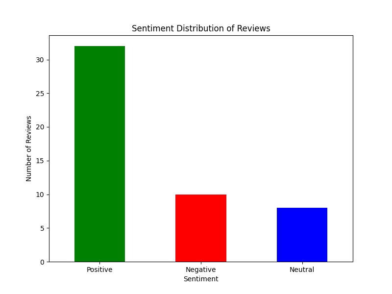

# Sentiment Analysis Report

## Sentiment Distribution
| sentiment   |   count |
|:------------|--------:|
| Positive    |      32 |
| Negative    |      10 |
| Neutral     |       8 |

## Approach
1. **Load the Dataset**: Loaded the dataset from the provided Excel file.
2. **Data Cleaning**: Removed null values and unnecessary columns.
3. **Text Preprocessing**: Converted text to lowercase and removed punctuation.
4. **Sentiment Analysis**: Used TextBlob to analyze the sentiment of each review.
5. **Summary Report**: Generated a summary report showing the distribution of sentiments.

## Challenges Faced
- **Column Identification**: Assumed the reviews were in a column named 'review'. Adjustments may be necessary if the column name differs.
- **Sentiment Analysis Limitations**: The sentiment analysis is based on TextBlob, which uses a simple rule-based approach and may not capture complex sentiments.

## Assumptions Made
- The reviews are in a column named 'review'.
- The dataset contains no other necessary preprocessing steps beyond those mentioned.

## Visual Representation

